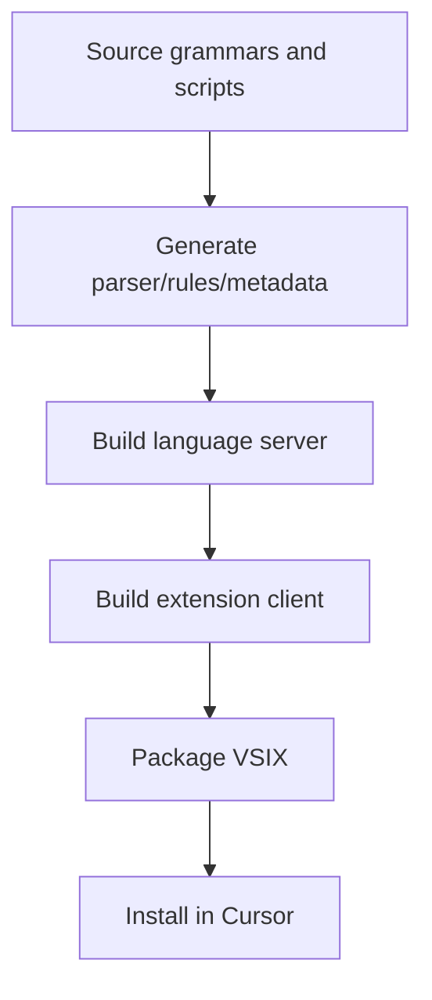
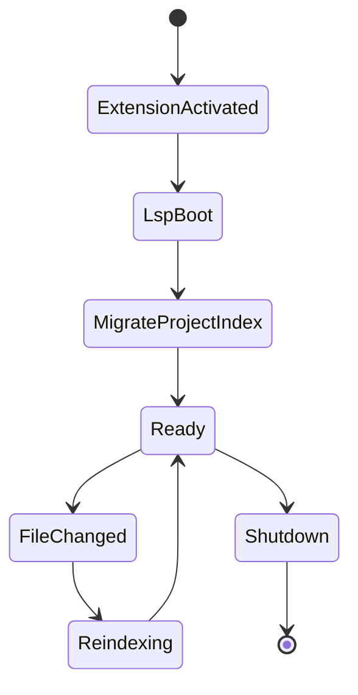

# Helium Rapid DSL Toolchain (Cursor-First)

This monorepo builds and packages the Helium Rapid DSL tooling stack used by Cursor: language server, MCP server, and extension packaging pipeline.

## Monorepo Layout

- `helium-dsl-language-server/` - parser/index/diagnostics language server.
- `helium-rapid-dsl-mcp/` - MCP server for agent-grade DSL analysis tools.
- `helium-dsl-vscode/` - extension client.
- `helium-vscode-tooling/` - generation/build/package scripts.

## Critical Rules

- Primary target IDE is Cursor.
- Do not manually edit generated artifacts:
  - `helium-vscode-tooling/generated/**`
  - `helium-dsl-language-server/generated/**`
  - `helium-dsl-language-server/out/**`
  - `helium-vscode-tooling/dist/**`
- Update source/scripts first, then regenerate.

## Quick Start

```bash
npm install
npm run build
npm run test
```

Useful targeted paths:

- Package extension: `helium-vscode-tooling/scripts/` and packaging scripts.
- MCP work: `helium-rapid-dsl-mcp/`.
- Language diagnostics/indexing: `helium-dsl-language-server/`.

## Build and Packaging Workflow



## Extension Runtime State Machine



## Human + AI Agent Onboarding Checklist

1. Read repository rules under `.cursor/rules/` first.
2. Choose your layer (LSP, MCP, or packaging) before changing code.
3. Never patch generated output directly.
4. Rebuild and rerun affected tests after changes.
5. Validate local VSIX install in Cursor when extension behavior changes.

## Deep References

- `helium-rapid-dsl-mcp/README.md`
- `run.md`
- `.cursor/rules/` for project-specific constraints

